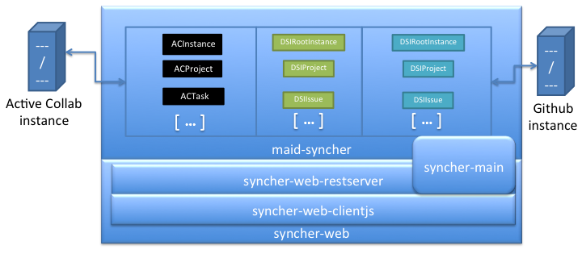

## Architecture

The MaidSyncher is made of the following parts:

 - **_maid-syncher_** - The principal domain of the application. It contains the domain model that: persists 
 the two representations of the GitHub (*GH*) and ActiveCollab (*AC*) artifacts, used to keep track of changes made to them on the servers;
 contains all of the core sync logic and logs; contains the AC REST lib used to communicate with the AC sevice; 
 - **_maid-syncher-tests_** - JUnit tests that run agains the `maid-syncher` module
 - **_syncher-main_** - classic 'main' Java command line executable - and used also as scheduler task - that takes care of getting
 data from the AC and GH services, and triggering the sync proccesses (and logs) making sure that atomicity is set where it needs to.
 - **_syncher-web-clientjs_** - html markup and templates, longside with the Javascript MVVM application (Knockback, soon bennu-knockout + knockback);
 - **_syncher-web-restserver_** - The root of all of the REST api, plus the integration with the [`bennu-scheduler`](https://github.com/ist-dsi/bennu/tree/develop-2.0/server/bennu-scheduler)
 module, that uses the syncher-main as a recurring task to sync both services (GH and AC);
 - **_syncher-web_** - the webapp final package a mixture of: `syncher-web-clientjs` and `syncher-web-restserver`, plus the web
 app configuration

### Domain Model

The domain model of the application is briefly explained here. Instead of being an exhaustive explanation
of all the classes, this explanation separates them into groups and explains their general role on the 
application.

#### Package `pt.ist.maidSyncher.api.activeCollab`

Library used to communicate via AC's REST API with the AC service. It was almost fully developed by a non Java developer,
which explains a bit of its style (i.e. not using for each'es; not using gson reflection to serialize/
deserialize the beans to and from JSON, etc).

#### Lib `org.eclipse.egit.github.core`

Library used to communicate with GH's services via its REST api. Original project page, 
[here](https://github.com/eclipse/egit-github). 

#### Persisted instances 

The application persists all of the GH and AC artifacts it encounters, so that it can track the changes
that were made to them (Updates, and of what fields, Creates, Deletes, etc). The next topics explain
in its generality, the different packages and their relationships.

<!-- TODO: Use bootstrap accordion here for show 

  

    

      <a class="accordion-toggle" data-toggle="collapse" data-parent="#pinstancesAccordion" href="#collapseOne">
        Package `pt.ist.maidSyncher.domain.activeCollab`
      </a>
    

    

      

        Anim pariatur cliche...
      

    

  

  
  

    

      <a class="accordion-toggle" data-toggle="collapse" data-parent="#pinstancesAccordion" href="#collapseTwo">
        Collapsible Group Item #2
      </a>
    

    

      

        Anim pariatur cliche...
      

    

  

  

-->

##### Package `pt.ist.maidSyncher.domain.activeCollab`

Persisted instances of AC's artifacts. The class names are the same as the ones of the classes of the
`pt.ist.maidSyncher.api.activeCollab` package. i.e. AC[Name of artifact]

_which I admit, that it wasn't the best choice due to the need to add the full classname_

It also has the [sync behaviour](#synchingBehaviour) implementation.

##### Package `pt.ist.maidSyncher.domain.github`

Persisted instances of GH's artifacts. The class names follow the same convention as the activeCollab ones
i.e. GH[Name of artifact on GH and Egit library];

It also has the [sync behaviour](#synchingBehaviour) implementation.

<a id="domainDsi"><!-- placeholder --></a>
##### Package `pt.ist.maidSyncher.domain.dsi`

It provides all of the classes that serve the purpose of bridging between the persisted instances on
one service and their persisted counterparts on the other service. e.g. an `ACTask` has a one-to-one relation to 
a `DSIIssue` which in place has a one-to-one relation to a `GHIssue`.

#### Package `pt.ist.maidSyncher.domain.sync`

Contains all of the persisted and not persisted classes that are synchronization artifacts, in more details:

 - Package `pt.ist.maidSyncher.domain.logs` all of the persisted logs (shown on the web interface):
 
  - `SyncLog` - the Log of a synchronization, that can have multiple `SyncActionLog`,
		`SyncEventConflictLog` and `SyncWarningLog`;
		
  - `SyncActionLog` - log that relates on a one-on-one relationship with the 
		[`SyncActionWrapper`](#syncActionWrapper), containing all of the info regarding the 
		success/failure of the wrapper, as well as details on its action;
		
  - `SyncEventConflictLog` when several updates on the same 'DSI' object (i.e. an object
		from the [`pt.ist.maidSyncher.domain.dsi`](#domainDsi) package) are made, the result,
		can be a conflict were only one of the objects wins. Imagine an update on the description
		of an ACTask and an update on the GHIssue description, only one of those actions should
		endure. If any conflict is detected, a log is made, and it is shown on the web interface.
		
  - `SyncWarningLog` - If any kind of warning is detected when creating/executing a Sync or 
		a SyncAction, e.g. when the Sync code of an artifact fails to consider a change on a given
		artifact field.
		
 - Class `APIObjectWrapper` - simple wrapper to all of the instances of both `pt.ist.maidSyncher.api.activeCollab`
	and `org.eclipse.egit.github.core`, that provides a method to make sure that the object is still 'fresh' i.e.
	that it's as up to date as the one currently on the server. And another method to get that instance.
	
 - Class `SyncActionWrapper` - an interface for all of the Sync actions that the application does. 
	All of the 'sync code' is responsible to create an instance of this class, that is the way that the application
	has to apply the needed changes on both services. Its API also provides a way to specify the run order of the
	actions based on its dependencies. e.g. an ACSubTask requires that its parent ACTask has already been synched,
	as well as all of changes detected in all of the `DSIRepository` instances. (more details, [here](#acSubTaskSync)).
	
 - Class `SyncEvent` - when a change between what is persisted and what is on the service is detected, an
	instance of this class is generated. Detailing both the fields that changed, the type of change, universe,etc.
	Typically, each `SyncEvent` will lead to the creation of a `SyncAction` (unless a conflict between two `SyncEvent`s
	is detected. If so, only one `SyncEvent` will endure). If the `SyncAction` execution doesn't go as planned,
	the `SyncEvent` should remain on the 'toProcess' list of the application;
	
#### Class `SynchableObject`

It is the basis of all the persisted versions of both ACs and GHs artifacts. More notibly, it contains:

 - the method `findOrCreateAndProccess` - responsible to find an already existing AC or GH artifact,
	based on either the ID or its URL (or create a new one if needed).
	 If this method is called as the result of a SyncAction, it should
	not generate a SyncEvent, thus the boolean flag `skipGenerateSyncEvent` should be set to true;
	
 - the method `generateSyncEvent` - generates the `SyncEvent` instances - and adds them to the queue,
 which might result in a conflict.
 
 - the methods `copyPropertiesFrom` and `copyPropertiesTo` - inspired on BeanUtils's 
 [copyProperties](http://commons.apache.org/proper/commons-beanutils/apidocs/org/apache/commons/beanutils/BeanUtils.html#copyProperties(java.lang.Object, java.lang.Object))
 but that at the same time returns the Strings of the PropertyDescriptors that changed. And are
 fitted to be used with egit's GH REST API lib - which uses flow like methods that would normally be ignored
 by the Vanilla flavour of the BeanUtils#copyProperties  
		 

<a id="synchingBehaviour"><!-- placeholder --></a>
### Synching behaviour

This section describes, in detail, the synching behaviour of this aplication, given creations/updates of GHs and ACs
artifacts e.g. what happens on GitHub when an ActiveCollab task (ACTask) is created.

For the purpose of this tutorial, the next topics will cover the several artifacts of GH and AC services.
Each artifact will have a topic, and creations (CREATE) updates (UPDATE) and delete (DELETE) behaviours, will be
explained in detail. These are the specifications of the App itself, what it ought to do, and is subject to being
replaced with actual live documentation, if eventually BDD is used in this project (as this is a good candidate for that
:)).

<a id="acTaskSync"><!-- placeholder --></a>
### ACTask - ActiveCollab's Task artifact;

By default, an ACTask will not have a corresponding GHIssue on the GH side. In order to have one, a
TaskCategory that corresponds to a Repository must be assigned. As a convention, those categories will have
the name of: 'R-<repository name>' which will correspond to a repository on the GitHub side. Assigning a TaskCategory
to an ACTask that corresponds to a GHRepository, will create a corresponding GHIssue (and eventually multiple others for
any subtasks) where:
 
 - The GHLabel will have at least the project label of the ACProject where the task is;
 - If the ACTask has a milestone, a milestone with the same name will be used/created on the GHRepository;
 - For each ACSubTask belonging to the ACTask, a GHIssue will be created, and its description will
 make a reference to the 'parent' GHIssue (as GH does not provide the same Task<->Subtask hierarchy that AC does);
   

#### CREATE

When the creation of an ACTask is detected, the following actions take place:

If the ACTask has a Category (ACTaskCategory) that does not have a GitHub side (no associated
GHRepository), no sync action takes place;

If it has a GitHub side, an Issue will be created on the GH side, with the following characteristics:
 
 - GHRepository associated with the ACTaskCategory;
 - GHLabel P-<name of the ACProject> - the GHLabel is created if it doesn't exist;
 - GHMilestone, in case an ACMilestone is associated with the task, with the same name as the one on the ACProject.
 If this GHMilestone doesn't yet exist, it is created;
 - Body with the same content as the `ACTask#getBody()`;
 - Title with the same content as `ACTask#getName()`;

#### UPDATE

 - If the `ACTaskCategory` changed, and the new `ACTaskCategory` has a GitHubSide:
 	
 	- A new corresponding `GHIssue` is created on the new `GHRepository` (taken out from the new `ACTaskCategory`);
 	
 	- If we used to have an 'old' `GHIssue` on another `GHRepository`:
 		
 	    - Move the old issue:
 		- Set the label 'deleted' on the old `GHIssue` (if the label doesn't exist, create it;
 		- Close the old `GHIssue`;
 		- Put a reference on the description of the old `GHIssue` to the new one
 	
 	- For each `ACSubTask`, if any exists, do the following:
 		- If the old `GHIssue` corresponding to this `ACSubTask` doesn't exist - use the 
 		 `ACSubTask#createGHIssueForSubTask()` to create the new corresponding `GHIssue`;
 		- If an old `GHIssue` exists:
 		   - Create the new `GHIssue` in the new `GHRepository`
 		   - 'Move the old issue' (see description above)
 		   
 - If the ACTaskCategory hasn't changed, or the new ACTaskCategory doesn't have a GitHub 
 side: - then a simple field changed - i.e. name; body; complete; project; milestone; and the corresponding
 parts of the GHIssue will change, title; description; state; label; milestone.
 
 - If the new ACTaskCategory doesn't have a GitHubSide, nothing happens now - Bug?;
 
 		   
#### DELETE - TODO -

 - Question - apply the 'Deleted' label to the GHIssue, if any exists, and close it;
 
 
 <a id="acTaskCategorySync"><!-- placeholder --></a>
### ACTaskCategory - ActiveCollab's Task Category artifact;

All of the actions on this artifact (`CREATE` `UPDATE` and `DELETE`) are ignored, as this artifact is not
directly synched (it is going to be used to indicate the GHRepository of a Task, but creation and applying
the right Task Categories to the right tasks is a responsability of other artifacts. (more 
specifically: the [GHIssue sync](#ghIssueSync); [ACProject sync](#acProjectSync), and others).

 <a id="acProjectSync"><!-- placeholder --></a>
### ACProject - ActiveCollab's Project artifact;

An ACProject will have a corresponding GHLabel on each GHRepository available;
This GHLabel will make possible for a user to select in which ACProject the GHIssue's corresponding ACTask will be
placed.

Also, for each GHRepository, a default ACProject with the same name will be created/used where by default the
corresponding ACTask's of each GHIssue on those repositories will be placed. 

#### CREATE

 - In case a project is archived, no sync action occurs;
 - For each GHRepository known, a corresponding P-<name of ACProject> label will be created/used;
 - For all of the known GHRepository instances, a ACTaskCategory will be created/used;
 
#### UPDATE

 - if the ACProject is archived, all the GHLabels on all of the GHRepository's are deleted;
 - if the name of the ACProject changes, all of the names of the GHLabels on all GHRepository's are changed; 
 
#### DELETE - TODO -
 
 - Like when an UPDATE is detected and the ACProject is archived, the GHLabels of all the GHRepository's should
 be deleted;
 

 <a id="acSubTaskSync"><!-- placeholder --></a>
### ACSubTask

Seen that GitHub does not have the same Task -> Subtask hierarchy that ActiveCollab has, we decided to still
create a GHIssue on the GitHub for each ACSubTask, as long as the ACTask a ACTaskCategory with a valid GHRepository.

#### CREATE

 - If the parent ACTask does not have a GHSide, nothing is done, if else:
 	- A GHIssue with a description pointing to the 'parent' GHIssue will be created;

#### UPDATE

 - If the name, or state (complete or open) is changed, the corresponding GHIssue (if any) is updated;
 
#### DELETE - TODO -

 - If a corresponding GHIssue exists, the label DELETED should be applied to it and it should be closed - i.e. the
 same that should happen to a GHIssue of a deleted ACTask;
 
<a id="acMilestoneSync"><!-- placeholder --></a>
### ACMilestone - ActiveCollab Milestone artifact;

ACMilestones are synched per ACTask - i.e. for each ACMilestone, several GHMilestones might exist, in different
GHRepository instances (as the GHRepository where the ACTask corresponding GHIssue is created might difffer).

#### CREATE
 
 - Nothing is done! A creation of an ACMilestone per se, isn't a reason to create a GHMilestone. The 
 creation of the GHMilestone's will be dictated if there are going to be ACTask instances that use that
 milestone and have an ACTaskCategory with 'a GH side' (check [ACTask sync behaviour](#acTaskSync) for more info.). 
 
#### UPDATE

 - In case any of the following fields change, their correspondents on GH, on possibly multiple instances of GHMilestone,
 will change:
 	
 	- name -> title;
 	- body -> description;
 	- dueOn -> dueOn; 
   
#### DELETE - TODO -

 - When deleting an ACMilestone, the corresponding GHMilestone(s) should be deleted as well;

<a id="ghRepositorySync"><!-- placeholder --></a>
### GHRepository - GitHub Repository artifact;

Each GHRepository will have a default ACProject on the AC side. Also, each task on that GHRepository
will be imported to that default ACProject, by default.

Also, the representation of the GHRepository on the AC side will be an ACTaskCategory for that GHRepository
for each existing ACProject.

#### CREATE

 - A default ACProject with the same name of the GHRepository is used/created;
  
  - If a default ACProject is being created, it is created with a ACTaskCategory instance for each active
  GHRepository found.
  
 - For each existing ACProject, the new ACTaskCategory that corresponds to this GHRepository, is created
 (with the name R-<repository name>).
 
#### UPDATE 

 - case the name of the GHRepository changes:
 	
 	- the default ACProject name changes
 	- All of the ACTaskCategory name change as well
 	
#### DELETE - TODO
??

<a id="ghIssueSync"><!-- placeholder --></a>
### GHIssue - GitHub Issue artifact;

By default, all GHIssue will have a corresponding ACTask on the default ACProject that exists per repository.
If a different ACProject is to be used, its corresponding P-<name of ACProject to use> should be set on that 
GHIssue (TODO - for now, all of the GHIssue's are created on the default project).

Also, GHIssues might be mapping to ACSubTasks, only if the ACSubTask is created on the AC side (i.e. with this system,
it's impossible to create a corresponding ACSubTask from a GHIssue created on the GH side).

#### CREATE
 - if the GHIssue has the 'deleted' label, no sync occurs;
 - Else:
  
   - An ACTask with the same name and description (body), and state (complete bool) is created on the default
    repository;
    -If this GHIssue has a GHMilestone, a corresponding ACMilestone will be used/created on the default ACProject;
    - Its ACTaskCategory will be set to one that corresponds to the GHRepository;

#### UPDATE

Two distinct cases apply:
	
 - **This GHIssue corresponds to an ACTask** :
  - if the Label changed, the following happens:
   - The ACProject of the corresponding ACTask is determined as following:
    - if more than one label with a corresponding ACProject is set, or none, the default ACProject is used;
    - if only one label with a corresponding ACProject is set, that ACProject is used;
   - if the new ACProject (based on the GHLabel) is different from the previous one, an ACTask move happens;
   - if the milestone changed, one with the name of the new one is used/created;
   - the state (complete/open); body; and title are updated if they have changed;
	
 - **This GHIssue corresponds to an ACSubTask** :
  - label changes have no impact (only label changes on the parent GHIssue should change the
	  location of the childs - TODO);
  - Body (description) changes, will make sure that the prefix (relating that issue with its parent)
    will be enforced.
  - Title changes will change the name of the ACSubTask;

#### DELETE
 - There are no GHIssue deletes, only applying the DELETE label, where nothing should happen ( - TODO: test if
 there the syncs do not occur when DELETE label is set -)

<a id="ghMilestoneSync"><!-- placeholder --></a>
### GHMilestone - GitHub Milestone artifact;

GHMilestone instances can have multiple ACMilestone instances, in different projects, depending on which ACProject
the corresponding ACTasks of the GHIssue instances that use the GHMilestone are.

The GHMilestone synchronization will partially be dealt by the [ACTask sync](#acTaskSync) method. However,
updates to its fields will be tracked by synched in the GHMilestone#sync method 

#### CREATE
 - Nothing is done, the creation of the corresponding ACMilestone is defined by the [ACTask sync](#acTaskSync);
 
#### UPDATE
 - Changes to the following simple fields (description/title/dueOn) will be repeated on the equivalent ActiveCollab
 'side';

#### DELETE

 - Delete the potential multiple ACMilestone instances associated with this ACMilestone - TODO - ;

<a id="ghLabelSync"><!-- placeholder --></a>
### GHLabel - GitHub Label artifact;

GHLabels are the way we have to choose the ACProject to use on the GitHub side. Special labels with the name
P-<ACProject name> should be created for each existing ACProject, and setting **one** of those labels on a
GHIssue should make the corresponding ACTask be created on that ACProject. (more details [here](#ghIssueSync))

#### CREATE
 - Nothing is done. Creation of the 'special' GHLabels is done on the [ACProject sync](#acProjectSync); and the
 'normal' GH labels are not synched; 

#### UPDATE
 - Updates of label changes is also controlled by the [ACProject sync](#acProjectSync), whereas also the 'regular'
 GHLabels aren't synched;

#### DELETE - TODO
 - TODO: define behaviour;

 

 
    
 

